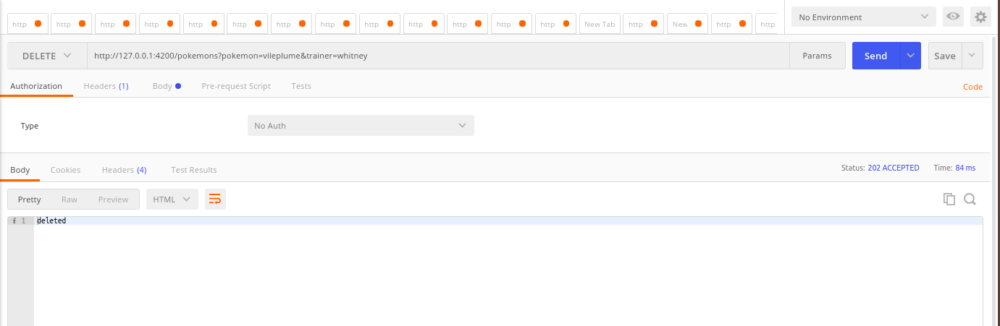
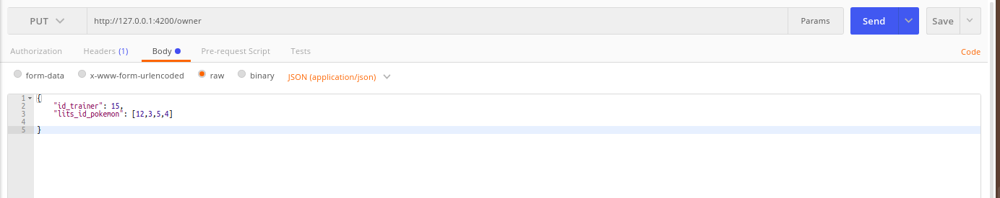

## PokeCorp
PokeCorp is a company that tracks pokemon and their trainers around the world

## Usage Guide

http://127.0.0.1:4200/
 

http://127.0.0.1:4200/types

## 

http://127.0.0.1:4200/pokemons

Fields marked in blue are mandatory fields for entry into the DB
## 

http://127.0.0.1:4200/pokemons?type=<p_type>

## 

http://127.0.0.1:4200/pokemons?trainer=<name_trainer>

## 

http://127.0.0.1:4200/pokemons?id=<id_pokemon>

## 

http://127.0.0.1:4200/trainer?pokemon=<name_pokemon>

## 

http://127.0.0.1:4200/evolve?pokemon=<name_pokemon>&trainer=<name_trainer>
")

## 

http://127.0.0.1:4200/pokemons?pokemon=<name_pokemon>&trainer=<name_trainer>

## 
http://127.0.0.1:4200/owner
