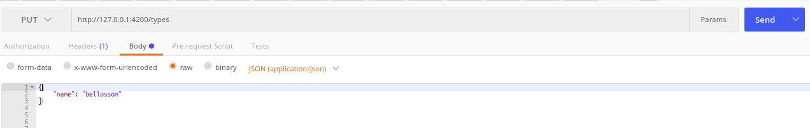

## PokeCorp
PokeCorp is a company that tracks pokemon and their trainers around the world

## ScreenShots

Get pokemons by type
Get pokemons by trainer
Get trainers of a pokemon
Evolve (pokemon x of trainer y)
delete pokemon of trainer

