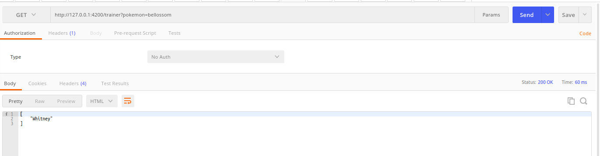

## PokeCorp
PokeCorp is a company that tracks pokemon and their trainers around the world

## ScreenShots

 

## 

Fields marked in blue are mandatory fields for entry into the DB
## 

## 

## 

## 

## 

")

## 

